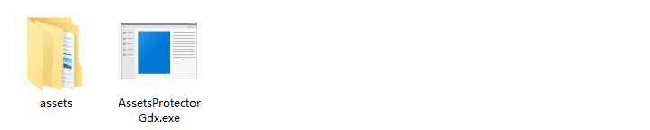

# Gdx-Assets-Protector-Examples

### 专为 libGDX 引擎设计的资源保护工具


---

### 功能特点

- **只需修改很少的代码即可保护您的 libGDX 游戏资源**

- **以包形式组织加密资源，支持同时加载多个加密包**

- **完全于内存解密，几乎不会有敏感内容暴露于磁盘**

- **与 libGDX AssetManager 几乎相同的使用方式，学习成本极低**

- **只在您需要时解密需要的资源，内存占用率低，保护效果好**

- **耗时部分使用 C++ 等本地代码实现，性能更高**

- **支持 Windows 与 Android 双平台**

- **基于 ChaCha20-Poly1305 算法的加密，在移动端也有良好的性能表现**

---

### 工具下载

[资源加密工具(Windows)](README-Res/AssetsProtectorGdx.exe)

[运行时库(包含Windows原生库)](README-Res/gdx-protector.jar)

[运行时库(不含Windows原生库)](README-Res/gdx-protector-android.jar)

[Android原生库](README-Res/android-native-libs.zip)

---

### 简要教程

###### 在开始前，请确保您下载了[资源加密工具(Windows)](README-Res/AssetsProtectorGdx.exe)，如果需要跨平台编译，请下载[运行时库(包含Windows原生库)](README-Res/gdx-protector.jar)，其中包含了 Windows 项目所需的 dll 库，如果仅编译安卓项目，请下载[运行时库(不含Windows原生库)](README-Res/gdx-protector-android.jar)，这将有效减少生成的 apk 文件大小。如果您要编译 Android 项目，还请下载[Android原生库](README-Res/android-native-libs.zip)。

##### 1. 使用资源加密工具加密资源文件

请将资源加密工具与包含您所有待加密资源的文件夹放于同一目录下，并运行资源加密工具



1. 在 *Please input your assets path* 步骤，请输入您的资源路径，必须使用相对路径（在本例中是 assets），否则会出现错误。

2. 在 *Use password or random key to crypto assets?* 步骤，按下 0 或者 1 以选择加密方式，0 为随机密钥方式，1 为密码方式。密码方式也会在工具内部通过哈希计算密钥，我推荐您使用密钥方式，这更为安全。如果选择密码方式，请在下一步输入您的密码。

3. 在 *Please input the file path of the encrypted package* 步骤，请使用相对路径输入加密文件的保存位置，例如 secretPackage/package.bin，这会使加密文件保存到当前文件夹的secretPackage目录下，名为package.bin。敲下回车，您应该可以在该目录下看到您的加密文件和与它同名的两个附加文件。

**附加文件说明**

***.key**  32字节的密钥文件，使用密钥方式加密时解密需要用到。

***.log**  加密日志文件，写有密钥，密码（密码方式加密）以及加密包中所有的资源文件路径，绝对不可泄漏。

**注意：您可以自行决定加密文件的后缀名，但请不要使用 .key 或 .log ，这会导致附加文件生成失败。**

##### 2. 配置运行时库（gradle环境）

- 仅 Windows
  
  下载[运行时库(包含Windows原生库)](README-Res/gdx-protector.jar)，在 core 目录下新建 libs 目录，将运行时库放置于该目录，在 core/build.gradle 中添加如下语句，并刷新 gradle 项目，这会使 core 模块引用 core/libs 目录下的所有库。
  
  ```groovy
  dependencies {
      api fileTree(include: ['*.jar'], dir: 'libs')
  }
  ```
  
  结束了，仅此而已。

- 仅 Android
  
  下载[运行时库(不含Windows原生库)](README-Res/gdx-protector-android.jar)，在 core 目录下新建 libs 目录，将运行时库放置于该目录，在 core/build.gradle 中添加如下语句，并刷新 gradle 项目，这会使 core 模块引用 core/libs 目录下的所有库。
  
  ```groovy
  dependencies {
      api fileTree(include: ['*.jar'], dir: 'libs')
  }
  ```
  
  下载[Android原生库](README-Res/android-native-libs.zip)，将 android-native-libs 目录下的文件解压到 android/libs 目录下。

- 跨平台编译
  
  仅需将 Android 配置方法中的运行时库替换为[运行时库(包含Windows原生库)](README-Res/gdx-protector.jar)即可。

##### 3. 基本代码

运行时库的核心类是 SecretAssetManager，该类的使用方法类似于 AssetManager，但拥有从加密包中加载资源的能力。

```java
SecretAssetManager manager = new SecretAssetManager();
```

loadPackage 是 SecretManager 的特有方法，可以载入加密包。

```java
// 载入 data.msf 包，密码为 muzistudio
manager.loadPackage(Gdx.files.internal("data.msf"), "muzistudio");
// 载入 data.msf 包，密钥为 data.key 文件
manager.loadPackage(Gdx.files.internal("data.msf"), Gdx.files.internal("data.key"));
// 载入 data.msf 包，密钥为提供的字节数组(32位)
manager.loadPackage(Gdx.files.internal("data.msf"), new byte[]{...});
```

从加密包中加载资源，其中资源路径可以参考资源加密工具生成的 *.log 文件，SecretAssetManager 同样支持从一般路径加载文件，只需要去掉类的 Secret- 前缀即可。

```java
// 从加密包中加载资源，类型为 SecretTexture.class
manager.load("Texture/gdx.png", SecretTexture.class);
// 从正常路径加载资源，类型为 Texture.class
// manager.load("Texture/gdx.png", Texture.class);
// 等待资源加载完毕
manager.finishLoading();
// 获取资源，由于 SecretTexture 继承自 Texture，两者可以自动转换，但有部分类不支持此转换，请参见后文
Texture texture = manager.get("Texture/gdx.png");
```

现在您可以使用从加密包中加载出的 Texture 类了。


与原 AssetManager 相比，SecretAssetManager 支持加载 SecretFileHandle，基于此类可以实现任意加密文件的加载。此类类似于 FileHandle，但绝不能代替 FileHandle 用作其他 Gdx 类的参数，这是因为 SecretFileHandle 是 FileHandle 在内存上的模拟，实际上硬盘并不存在此文件。

```java
// 加载 SecretFileHandle
manager.load("FileHandle/secret.txt", SecretFileHandle.class);
// 等待资源加载完毕
manager.finishLoading();
// 获取 SecretFileHandle 对象
SecretFileHandle file = manager.get("FileHandle/secret.txt");
// 打印获取到的文件内容
System.out.println(file.readString());
```


带参数的加载，使用方法与原 AssetManager 一致

```java
// SecretBitmap 参数
SecretBitmapFontParameter parameter = new SecretBitmapFontParameter();
// 设置字体缩放比例为 2f （仅加密字体支持此参数）
parameter.fontScale = 2f;
// 在加载时传递参数
game.manager.load("BitmapFont/font.fnt", SecretBitmapFont.class, parameter);
```

**其他类的加载方式请自行查看此演示项目源码**

---

### 支持类

*加密类 - 原始类*

- **SecretBitmapFont - BitmapFont**

- **SecretFileHandle - FileHandle**

- **SecretI18NBundle - I18NBundle (不支持转换)**

- **SecretMusic - Music (不支持转换)**

- **SecretParticleEffect - ParticleEffect**

- **SecretPixmap - Pixmap**

- **SecretPolygonRegion - PolygonRegion**

- **SecretShaderProgram - ShaderProgram**

- **SecretSkin - Skin**

- **SecretSound - Sound (不支持转换)**

- **SecretTexture - Texture**

- **SecretTextureAtlas - TextureAtlas**

- **SecretTiledMap(.tide) & SecretTiledMap(.tmx) - TiledMap**

- **其他类（3D API）等待开发**

---

### 注意事项

- 该库最佳支持 libGDX 版本：1.12.0，1.10.0 版本以下未经测试。

- SecretMusic 与 SecretSound 类在Android平台由于 libGDX 后端原因，目前仅实现将音频解密到磁盘并播放。

- Android 端发布时，请在 android/proguard-rules.pro 文件中添加如下内容，这将防止混淆关键代码导致的无法运行。
  
  ```groovy
  -keep class com.sun.jna.** { *; }
  -keep class * implements com.sun.jna.** { *; }
  -keep class com.badlogic.** {**[] $VALUES;*;}
  ```
  
  并在 gradle.properties 文件中添加以下内容启用 AndroidX。
  
  ```groovy
  android.useAndroidX=true
  ```

- 加密的安全性主要取决于您对密钥或密码的保护，尽可能混淆代码以提高安全性。该工具不保证能承受混淆或加固，请谨慎使用。

---

### 声明

* 如需咨询问题，请加 libGDX 吧官方 QQ 群：1051955354  [点击加群](https://qm.qq.com/cgi-bin/qm/qr?k=nF1aCeY5JjPLtKLcmZqzISk-qBpXdmhm&jump_from=webapi&authKey=vJ0DKK9jsJCOX8cZhdoKVWG5obuthQHyyqNhlhaNnNjKhXDZkZVJa49xjLua/U4v)
* **如果工具对您有帮助，欢迎Star**
* 该工具未经大量测试，可能存在重大 bug，如果发现 bug，请提交 Issues，我将尽可能解决。